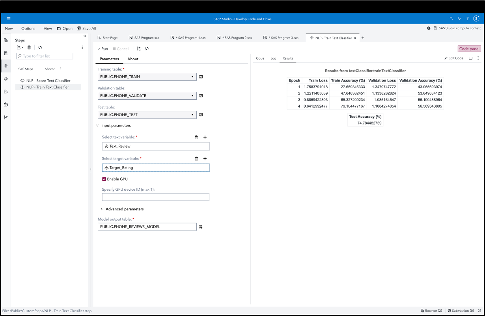

# Natural Language Processing (NLP) - Train Text Classifier

This custom step enables you to train a text classifier model based on deep learning (BERT-based transformer) architecture.

It uses the recently introduced SAS Visual Text Analytics (VTA) CAS action, textClassifier.trainTextClassifier.  This augments SAS approaches for Natural Language Processing-based classification models (in addition to rules-based classification). More details in the documentation (link provided below).

Use this to train models which can classify customer reviews as per a star rating, carry out sentiment analysis, prioritize customer complaints, identify serious adverse events, and many other classification use-cases.

Use of this custom step requires a SAS Visual Text Analytics (VTA) license.

## Screenshot

## SAS Viya Version Support
Tested in Viya 4, Stable 2023.02

## Requirements

1. A SAS Viya 4 environment (monthly release 2023.02 or later) with SAS Studio Flows.

2. **At runtime: an active connection to CAS:** This custom step requires SAS Cloud Analytics Services (CAS). Ensure you have an active CAS connection available prior to running the same.

3. A SAS Visual Text Analytics (VTA) license.

4. A GPU is preferred, due to its better performance.  However, note that availability and cost of GPU resources are however constraints for many environments.  Please expect significantly longer training times while using CPU resources.

## User Interface

### Parameters:

Note that this custom step runs on data loaded in SAS Cloud Analytics Services (CAS). Ensure you are connected to CAS before running this step.

#### Input parameters:

1. Input ports: connect CAS tables to the training table, validation table, and test table input ports.  At the minimum, a training table is required.

2. Text variable: select a variable containing the text you wish to train a classifier upon.  Ensure you select either a char or varchar variable.

3. Target variable: select a column containing the labelled target for which you wish to train a classifier. 

4. Enable GPU: choose between using GPU or CPU resources to train your model.  GPUs are recommended due to their performant nature.  At the same time, note that GPUs may not be readily available in all Viya environments, and may lead to higher cloud costs.  Check with your SAS administrator on the availability of GPU resources.

5. As an optional step, if you select Enable GPU, you may choose to provide the device ID of the GPU you wish to use.  Currently, the action allows for only 1 GPU device to be used.

6. Advanced parameters: you might like to modify hyperparameters governing the training process by changing provided default values.  Note this will affect speed and accuracy of your model.  It's suggested that you refer documentation (below) for more details.

#### Output table specifications:

- Output port: connect an output CAS table to contain the trained model.  Note that the output model is binary data which is not human-readable.

## Documentation:

- The [textClassifier.trainTextClassifier CAS action](https://go.documentation.sas.com/doc/en/pgmsascdc/default/casvtapg/cas-textclassifier-traintextclassifier.htm)

## Installation & Usage
- Refer to the [steps listed here](https://github.com/sassoftware/sas-studio-custom-steps#getting-started---making-a-custom-step-from-this-repository-available-in-sas-studio).

## Created / contact : 

- Sundaresh Sankaran (sundaresh.sankaran@sas.com)

## Change Log

Version : 1.0.   (18MAR2023)